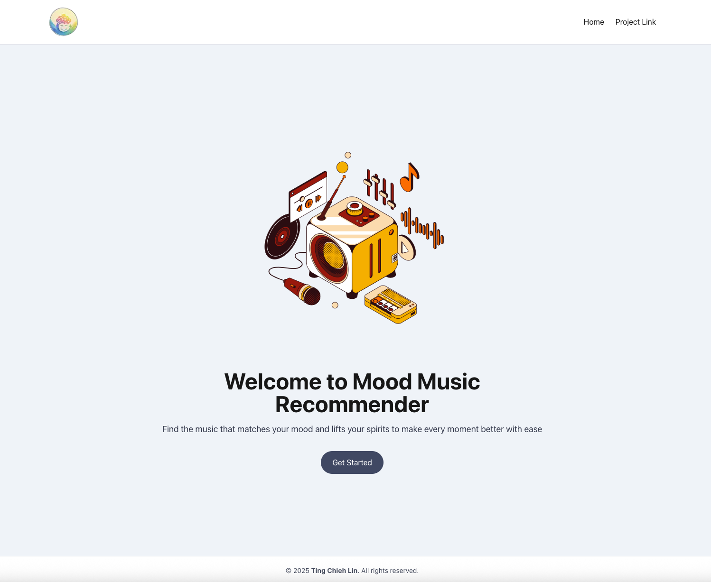
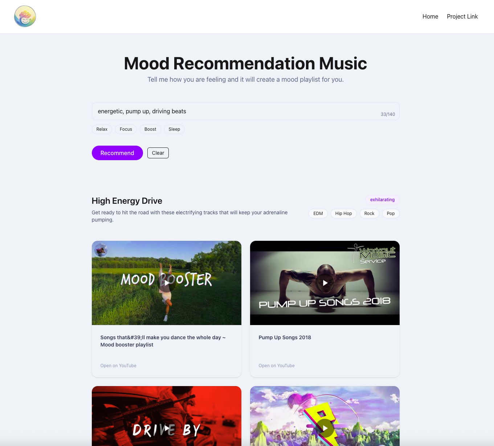

## title

This project capitalizes on the positive uses of music as a quick and efficient way to regulate one's emotions through the use of AI that can select the attributes of the selected music related to the moods the user wishes to regulate or change. For instance, the user can select moods through texts or emojis, or even the use of slider options. The AI can decide the best type of music based on factors like tempo, keys, genres, and instrumentation that can influence the mood the user wishes to develop. This service is user-friendly with links to private videos on YouTube. The best options for the user to choose are shown at the end.

## Demo Video

<div style="position: relative; padding-bottom: 56.25%; height: 0; overflow: hidden;">
  <iframe src="https://www.loom.com/embed/0b8e43d4611d4f8d8375035112f79b4e" 
          frameborder="0" 
          webkitallowfullscreen 
          mozallowfullscreen 
          allowfullscreen 
          style="position: absolute; top: 0; left: 0; width: 100%; height: 100%;">
  </iframe>
</div>

## Gallery

<div style="display: flex; gap: 10px;">
  
  
</div>

## Getting Started

### Run locally

**Backend**
```bash
cd backend
pip install -r requirements.txt
export FLASK_APP=app.py
flask run --port=5000
```

**Frontend**
```bash
cd frontend
npm install
npm run dev
```
Open [http://localhost:3006](http://localhost:3006) with your browser to see the result.

## What Techs I used

API:

- OpenAI

Frontend Dev:

- NextJS
- ReactJS
- TailwildCSS
- TypeScript
- React Query
- zod
- React-hook-form

Backend Dev:

- Python
- Flask
- requests
- jsonify

## Concept I used

- More Flow Control 
- File I/O
- Testing 
- Recursion  

## Learn More

To learn more about Next.js, take a look at the following resources:

- [Next.js Documentation](https://nextjs.org/docs) - learn about Next.js features and API.
- [Tailwindcss](https://tailwindcss.com/) - an interactive Next.js tutorial.


